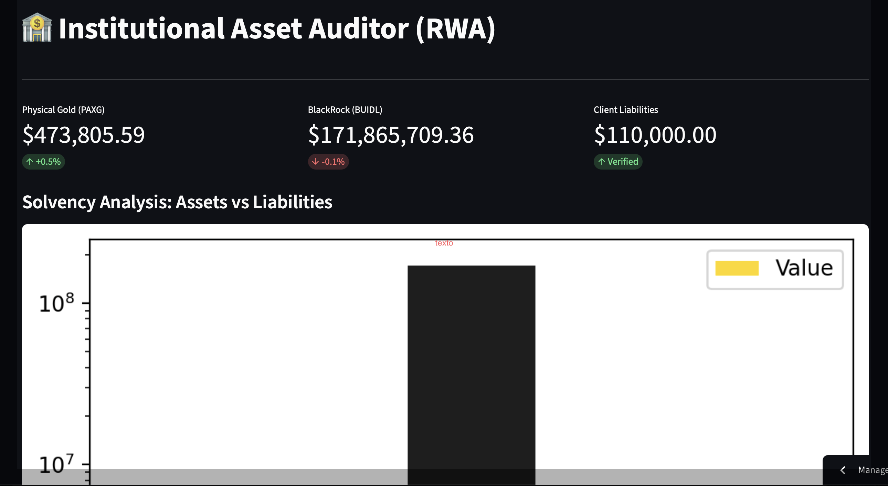

# 🏦 Institutional RWA Forensic Auditor & ZK-Proof Validator

A Full-Stack Web3 system designed for the cryptographic audit and verification of tokenized Real-World Assets (RWAs). This project solves the traditional banking transparency problem by allowing clients to cryptographically verify the backing of their deposits using Zero-Knowledge Proofs (ZK-SNARKs)—without exposing the central database or compromising user privacy.

## 👁️ Live Demo

**[Link to Live Dashboard](https://rwa-zk-auditor-o3ufi87cfjvh73pwdneym7.streamlit.app)**

## 🚀 Architecture & Core Features

1. **Real-Time Data Extraction:** - Direct connection to relational databases (Supabase) to extract institutional reserves of Physical Gold (PAXG) and Treasury Bills (BlackRock BUIDL).
2. **ZK Verification Engine (Zero-Knowledge):**
   - Native integration of `snarkjs` within a cloud server environment.
   - Users can input their private Client Hash to mathematically validate (via Groth16 protocol) that their balances are included in the audited Merkle Root, guaranteeing 100% solvency.
3. **Automated Forensic Alerts:**
   - Automated Python scripting that generates financial consistency reports and delivers them via email adhering to strict institutional formatting.
4. **Analytical "Stealth" Dashboard:**
   - User interface built with Streamlit, optimized for financial metrics visualization and Liabilities vs. Assets analysis using logarithmic scale charts.

## 🛠️ Tech Stack

* **Frontend & Analytical Backend:** Python, Streamlit, Pandas, Plotly/Matplotlib.
* **Database & Cloud:** Supabase (PostgreSQL), Streamlit Community Cloud (with Linux OS provisioning).
* **ZK Cryptography:** Circom, SnarkJS (Node.js / npx), Poseidon Hash.

## ⚙️ Cloud Deployment

The project is designed to run in environments that support both Python and Node.js. It utilizes a `packages.txt` file to provision the cloud server with Linux dependencies, allowing the Streamlit application to open an internal shell and execute SnarkJS cryptography in real-time.

